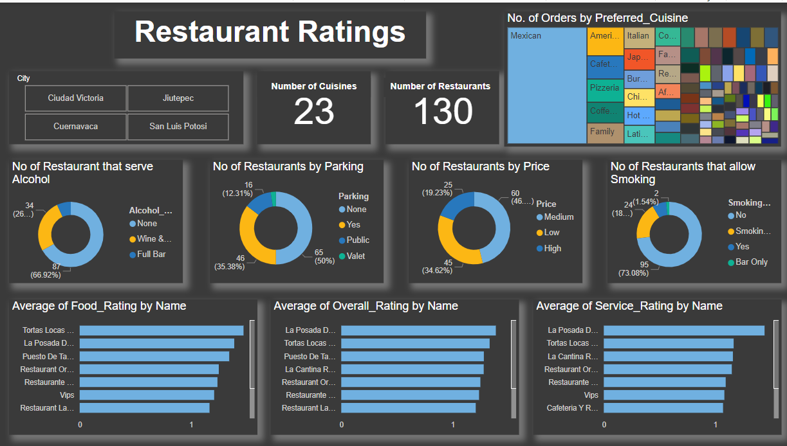

# Restaurant Ratings Analysis

## Introduction

This a power BI project on restaurant rating analysis of restaurants in Mexico. A customer survey was carried out in this city in 2012 to collate information about each restaurant, their cuisines, information about their consumers and the preferences of the consumers.
The project is to analyze and draw out meaningful insight from this dataset which would aid business entrepreneurs and investors in making more informed decisions.

## Problem statement

1.	What can you learn from the highest rated restaurants? Do consumer preferences have an effect on ratings?
2.	What are the consumer demographics? Does this indicate a bias in the data sample?
3.	Are there any demand & supply gaps that you can exploit in the market?
4.	If you were to invest in a restaurant, which characteristics would you be looking for?

## Skills/concepts demonstrated

The following Power BI features were incorporated;
DAX, quick measures, filtering, data modeling, tooltips.

## Modelling

Automatically derived relationships were adjusted to remove and replace unwanted relationships from the desired relationships.

## Visualization

The report consists of 3 pages;
1. Consumer demographics
2. Restaurant ratings
3. Consumer preferences

## Analysis

The following are answers to the problem statements;

1. The top 3 highest rated restaurants by food rating are Tortas Locas Hipocampo followed by La Posada Del Virrey and then Puesto De Tacos. By service rating, the top 3 restaurants are La Posada Del Virrey, Tortas Locas Hipocampo and La Cantina Restaurante. While by overall rating, we have La Posada Del Virrey, Tortas Locas Hipocampo and Puesto De Tacos.
It was observed that these top rated restaurants had parking space (either public or valet), they didn’t allow smoking, did not serve alcohol (except for La Posada Del Virrey that serves wine and beer), were within the medium and high price range and were mostly patronized by people in their 20s.
It was also observed that customer preferences had no effect on any of the ratings.

2. Consumer demographics include all the following factors
•	Age
•	Occupation
•	Marital status
•	Budget
•	Children (whether dependent or independent)
•	Mode of transportation
•	Drink level
•	Smoker
It can be seen that most of the consumers were in their 20s (119 of 138) which makes about 86.23% of the customers. 86.96% of the consumers are students by occupation leaving 11.59 employed and 1.45% unemployed. 92.75% of the consumers are single while 7.25% are married. 71.01% are on the medium budget, 25.36% with low budget and 3.62% on a high budget. 89.86% of consumers were independent of children leaving 7.97% being kids and 2.17% having dependent children. 64.46% used public mode of transportation, while 25.36% used cars and 10.14% walked to the restaurant. 36.96% of the consumers are abstemious, 34.06% are causal drinkers and 28.99% are social drinkers. 81.16% of the consumers do not smoke while the remaining 18.84% are smokers.
The bias in the data sample is for the consumers in the 20s age group. Since they make a large percentage (86.23%) of the consumers, the consumer demographics seems to be inclined towards them, hence you find a large percentage of the consumers being students, single, on a medium budget, independent of children, use public mode of transportation and are not smokers.

