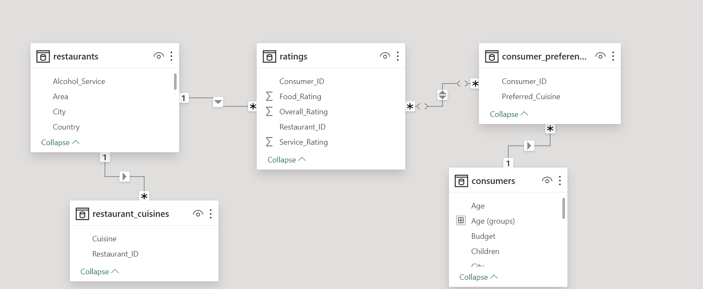

# Restaurant Ratings Analysis

## Introduction

This a power BI project on restaurant rating analysis of restaurants in Mexico. A customer survey was carried out in this city in 2012 to collate information about each restaurant, their cuisines, information about their consumers and the preferences of the consumers.
The project is to analyze and draw out meaningful insight from this dataset which would aid business entrepreneurs and investors in making more informed decisions.

## Problem statement

1.	What can you learn from the highest rated restaurants? Do consumer preferences have an effect on ratings?
2.	What are the consumer demographics? Does this indicate a bias in the data sample?
3.	Are there any demand & supply gaps that you can exploit in the market?
4.	If you were to invest in a restaurant, which characteristics would you be looking for?

## Skills/concepts demonstrated

The following Power BI features were incorporated;
DAX, quick measures, filtering, data modeling, tooltips.

## Modelling

Automatically derived relationships were adjusted to remove and replace unwanted relationships from the desired relationships.

## Visualization

The report consists of 3 pages;
1. Consumer demographics
2. Restaurant ratings
3. Consumer preferences

## Analysis

